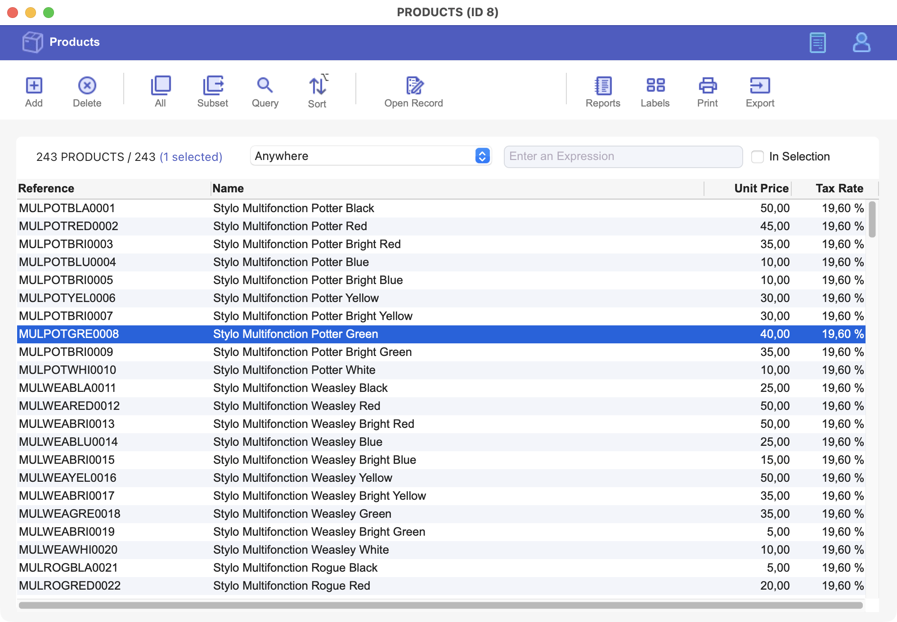

# EA_Invoices

Featuring: Subform, and Listbox

This application provides a ready-to-use invoicing system that can be adapted to fit various business needs. Users can create, edit, and manage invoices with ease, thanks to a clear structure for customers, items, and invoice details. The implementation combines Subforms, and Listboxes to deliver an intuitive workflow.

Minimum requirement: 4D 20 LTS

## Installing and Using a 4D Project

### Pre-requisites

* Download the latest Release version of 4D from: https://us.4d.com/product-download or the latest Beta version from: https://discuss.4d.com
* Follow the activation steps for 4D from: https://developer.4d.com/docs/GettingStarted/installation

### Steps to Run the Project

* Clone or download the GitHub repository containing the 4D project to your local machine. Need help, check out [this blog](https://blog.4d.com/github-4d-depot/).
* Open the 4D project in your 4D software by navigating to "File > Open Project".  You can find more details [here](https://developer.4d.com/docs/GettingStarted/creating#opening-a-project).
* Play with this HDI.
* Navigate to the "Mode/Return to design mode" menu to view the code.

By following these steps, you will be able to successfully install and run a 4D project.
